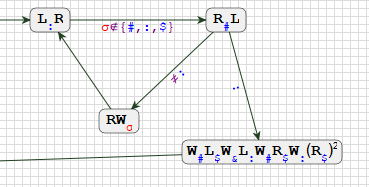

# Trabajo TP5

## Estructura de la Máquina de Turing

### Primera Parte

La primera parte de la máquina de Turing se encarga de contar en 1s consecutivos la aparición de la letra especificada en esta sección inicial.

### Segunda Parte

La segunda parte realiza el conteo en 1s consecutivos en la segunda sección.

### Tercera Parte

La tercera parte se encarga de recuperar las letras que fueron borradas durante las primeras dos etapas del proceso.

### Cuarta Parte

La cuarta parte convierte el conteo de 1s consecutivos en números naturales.

### Quinta Parte

La quinta y última parte se encarga de limpiar los residuos y corregir formatos inválidos, asegurando que los resultados finales sean claros y precisos. Y fin :).

